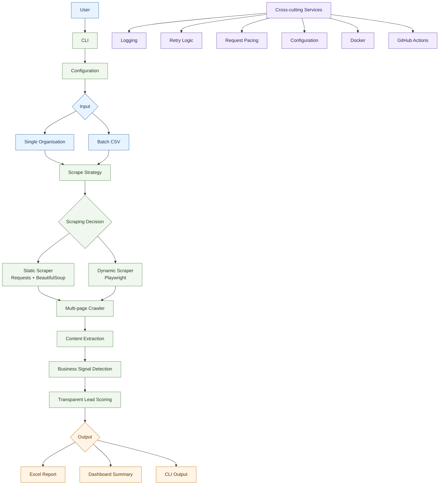

# Smart Infrastructure Lead Intelligence

[](https://github.com/Rakibul-cyber/smart-infrastructure-lead-intelligence/actions/workflows/ci.yml)


A production-oriented Python lead-research pipeline that discovers, analyses,
scores, and exports publicly available smart-infrastructure opportunities.

## Overview

Smart Infrastructure Lead Intelligence is a portfolio project for structured
B2B and B2G research. It crawls organisation websites, uses Requests and
Beautiful Soup for static pages, optionally falls back to Playwright for
JavaScript-rendered pages, extracts public business contact information,
detects transparent rule-based business signals, calculates a 0-100 lead
score, exports Excel reports, and prints a management dashboard. The project
also includes batch CSV analysis, central configuration, structured logging,
retries, request pacing, Docker packaging, Docker Compose, GitHub Actions CI,
and Dependabot configuration.

## Why This Project Exists

Sales, founder-led growth, and business-development teams often need to review
municipalities, utilities, infrastructure operators, and public-sector
organisations for signs of modernisation needs. Manual research is slow and
inconsistent. This project demonstrates how a Python pipeline can turn public
website information into reviewable lead records while keeping the scoring
logic explicit, inspectable, and suitable for human review.

## Key Capabilities

- Controlled crawling of a small number of internal pages per organisation.
- Static scraping with Requests and Beautiful Soup.
- Optional dynamic scraping with Playwright for JavaScript-rendered pages.
- Conservative `auto` mode that tries static scraping first and falls back only
  when static HTML appears insufficient.
- Extraction of public business emails, phone numbers, contact links, internal
  links, titles, headings, and visible text.
- Rule-based signal detection for street lighting, smart city, energy
  efficiency, climate action, infrastructure modernisation, procurement, and
  municipal utility signals.
- Transparent lead scoring from 0 to 100 with Low, Medium, and High priority
  classifications.
- Single-organisation and batch CSV command-line workflows.
- Excel export with lead records, evidence, and run summaries.
- Terminal dashboard for run-level management review.
- Structured logging, retry handling, request pacing, environment
  configuration, Docker packaging, and CI checks.

## Architecture



The application follows a modular pipeline architecture where each stage has a
single responsibility. This design makes the project easy to test, extend, and
maintain.

See [docs/architecture.md](docs/architecture.md) for component responsibilities.

## How The Pipeline Works

1. Read one organisation from CLI arguments or many organisations from a CSV
   input file.
2. Crawl a controlled number of internal pages for each organisation.
3. Use static scraping, dynamic scraping, or conservative automatic fallback.
4. Extract public business contacts, contact links, internal links, and visible
   page text.
5. Detect rule-based business signals and preserve evidence excerpts.
6. Score each lead from 0 to 100 using explicit weighted criteria.
7. Export Excel reports and print dashboard summaries.
8. Preserve row-level failures in batch mode without stopping the full run.

## Technology Stack

| Technology | Role |
| --- | --- |
| Python 3.12 | Application runtime and tests. |
| Requests | Static HTTP fetching. |
| Beautiful Soup | HTML parsing and text extraction. |
| Playwright | Optional Chromium rendering for dynamic pages. |
| openpyxl | Excel workbook generation. |
| pytest | Automated test suite. |
| Docker | Runtime and test image packaging. |
| Docker Compose | Local CLI container orchestration. |
| GitHub Actions | Continuous integration. |
| Dependabot | Weekly dependency update checks. |

## Project Structure

Compact repository view:

```text
smart-infrastructure-lead-intelligence/
├── src/lead_intelligence/      # CLI, scraping, crawling, scoring, and export modules.
├── tests/                      # Deterministic unit and integration tests.
├── data/input/                 # Fictional example batch input CSV.
├── docs/                       # Architecture, structure, screenshots, and release docs.
├── scripts/                    # Docker and screenshot helper scripts.
├── .github/                    # CI, Dependabot, and release-note metadata.
├── Dockerfile                  # Runtime and test image definitions.
├── docker-compose.yml          # Local CLI container orchestration.
├── requirements.txt            # Python dependency pins.
└── README.md                   # Project overview and usage guide.
```

See [docs/project-structure.md](docs/project-structure.md) for the full module
responsibility guide.

## Screenshots

Project screenshots are tracked or planned in the following order. The README
links to the capture guide instead of embedding images, so incomplete captures
do not create broken image references.

- [ ] CLI analysis — `docs/screenshots/cli-analysis.png`
- [x] Management dashboard — `docs/screenshots/dashboard.png`
- [ ] Excel workbook — `docs/screenshots/excel-report.png`
- [ ] GitHub Actions CI — `docs/screenshots/github-actions.png`
- [ ] Docker demo — `docs/screenshots/docker-demo.png`

[View the screenshot capture guide](docs/screenshots/README.md)

## Quick Start

macOS/Linux:

```bash
git clone https://github.com/Rakibul-cyber/smart-infrastructure-lead-intelligence.git
cd smart-infrastructure-lead-intelligence
python3 -m venv .venv
source .venv/bin/activate
python -m pip install --upgrade pip
python -m pip install -r requirements.txt
python -m playwright install chromium
python -m src.lead_intelligence --help
```

Windows users can use the same Python module commands after activating a local
virtual environment with the platform-appropriate activation script.

## CLI Usage

Show the available commands:

```bash
python -m src.lead_intelligence --help
```

Run safe fictional demo commands:

```bash
python -m src.lead_intelligence version
python -m src.lead_intelligence demo-dashboard
python -m src.lead_intelligence demo-export
```

The demo commands use fictional data and do not crawl live websites.

Exit codes:

| Code | Meaning |
| --- | --- |
| `0` | Success, including help, version, and demo commands. |
| `1` | Runtime analysis failure, no successfully analysed pages, or one or more failed batch rows. |
| `2` | Argument, configuration, or CSV validation error. |

## Single-Organisation Analysis

Analyse one organisation and print results without creating an Excel file:

```bash
python -m src.lead_intelligence analyse \
  --website https://example-city.de \
  --name "Example City" \
  --type Municipality \
  --city "Example City" \
  --state Hessen \
  --scrape-mode auto \
  --no-export
```

Analyse one organisation and write an Excel report:

```bash
python -m src.lead_intelligence analyse \
  --website https://example-city.de \
  --name "Example City" \
  --type Municipality \
  --city "Example City" \
  --state Hessen \
  --scrape-mode static \
  --output data/output/example_city.xlsx
```

Useful options include `--max-pages`, `--timeout`, `--request-delay`,
`--max-retries`, `--retry-backoff`, `--top-limit`, `--headed`,
`--wait-for-selector`, `--browser-wait`, `--accept-cookies`,
`--disable-business-priority`, and `--business-links-only`.

## Batch CSV Analysis

Run batch analysis from the committed fictional input example:

```bash
python -m src.lead_intelligence batch \
  --input data/input/organisations.example.csv \
  --output data/output/batch_report.xlsx
```

Required CSV fields:

- `organisation_name`
- `website`

Optional CSV fields:

- `organisation_type`
- `city`
- `state`

CSV headers are matched case-insensitively, and spaces or hyphens are treated
as underscores. Batch mode analyses each organisation independently. If one row
fails, later rows still run, successful records can still be exported, and a
failure CSV is written unless `--no-failure-report` is supplied.

The sample CSV contains fictional organisations and reserved example domains.
It is primarily a schema example; running batch analysis against it may still
attempt normal website requests.

## Static, Dynamic, And Automatic Scraping Modes

| Mode | Behaviour |
| --- | --- |
| `static` | Uses Requests and Beautiful Soup only. This is the fastest mode and the default. |
| `dynamic` | Uses Playwright Chromium rendering for JavaScript-rendered public pages. |
| `auto` | Tries static scraping first, then falls back to dynamic scraping only when visible static content appears insufficient. |

Dynamic mode supports optional headless/headed execution, a browser timeout, a
post-load wait, a CSS selector wait, and conservative cookie-button handling.

The project does not use Playwright to bypass blocked access, CAPTCHA,
authentication, robots restrictions, anti-bot controls, or access-control
systems. It does not use stealth plugins, proxies, or user-agent rotation.

## Business-Aware Page Prioritisation

The crawler uses transparent link scoring to spend limited page budgets on
domain-relevant pages first. Links related to smart infrastructure, street
lighting, energy, climate, modernisation, procurement, sustainability, and
municipal utilities receive the highest crawl priority.

Contact pages remain useful but are secondary, so they are queued after
business-relevant pages and before general internal pages. Privacy, login,
cookie, search, sitemap, accessibility, and common social-media links are
skipped.

This prioritisation is deterministic and configurable. Use
`--disable-business-priority` to restore the legacy contact-first queue order,
or `--business-links-only` to queue only business-relevant and contact links.
The same behaviour can be configured with `BUSINESS_LINK_PRIORITY_ENABLED` and
`GENERAL_LINKS_ENABLED`.

Business-aware ordering improves use of small `--max-pages` budgets, but it
does not guarantee that every relevant page on a website will be found.

## Excel Report Structure

Excel reports are generated with `openpyxl` and contain four sheets:

| Sheet | Contents |
| --- | --- |
| All Leads | One row per analysed organisation with contacts, signals, score, priority, and summary fields. |
| High Priority | A filtered lead table containing only High-priority leads, with headers even when empty. |
| Evidence | Signal evidence with organisation, website, category, keyword, excerpt, and source URL. |
| Run Summary | Aggregate counts, average score, and export metadata for the run. |

Generated `.xlsx` files in `data/output/` are ignored by Git, except for the
placeholder `.gitkeep`.

## Dashboard Summary

The terminal dashboard summarises a completed run for quick management review.
It reports:

- Lead counts by priority.
- Email and phone counts, including unique counts.
- Contact-link totals.
- Evidence item totals.
- Average, highest, and lowest scores.
- Top leads by score and priority.
- Most common business signals across analysed organisations.

## Configuration

Configuration can come from explicit environment variables or an optional
`.env` file:

```bash
cp .env.example .env
```

Configuration precedence:

1. Environment variables
2. Values from `.env`
3. Application defaults

Core configuration:

| Variable | Default | Description |
| --- | --- | --- |
| `REQUEST_TIMEOUT` | `20` | HTTP request timeout in seconds. |
| `REQUEST_DELAY_SECONDS` | `1` | Delay between different page URL requests during crawling. |
| `MAX_PAGES_PER_SITE` | `5` | Maximum successful pages to crawl per organisation. |
| `USER_AGENT` | `SmartInfrastructureLeadIntelligence/0.1` | HTTP User-Agent string. |
| `MAX_RETRIES` | `2` | Retry attempts for retryable request failures. |
| `RETRY_BACKOFF_SECONDS` | `1` | Base exponential retry backoff in seconds. |
| `OUTPUT_DIRECTORY` | `data/output` | Default generated-output directory. |
| `LOG_LEVEL` | `INFO` | Logging level. |
| `LOG_FILE` | blank | Optional UTF-8 log file path. |
| `SCRAPE_MODE` | `static` | `static`, `dynamic`, or `auto`. |
| `BUSINESS_LINK_PRIORITY_ENABLED` | `true` | Prioritise business-relevant internal links before contact and general links. |
| `GENERAL_LINKS_ENABLED` | `true` | Queue general internal links after business and contact links. Set to `false` to keep only business and contact links. |
| `BROWSER_HEADLESS` | `true` | Run Chromium headlessly in browser mode. |
| `BROWSER_TIMEOUT_SECONDS` | `30` | Browser navigation and action timeout in seconds. |
| `BROWSER_WAIT_AFTER_LOAD_SECONDS` | `0` | Optional post-load browser wait before parsing. |
| `BROWSER_WAIT_FOR_SELECTOR` | blank | Optional CSS selector to wait for in browser mode. |
| `BROWSER_ACCEPT_COOKIES` | `false` | Try conservative common cookie-accept buttons. |

The `.env` file is ignored by Git. Do not store secrets or real credentials in
this project.

## Docker Usage

Build the runtime image:

```bash
docker build -t lead-intelligence .
```

Run CLI commands:

```bash
docker run --rm lead-intelligence version
docker run --rm lead-intelligence demo-dashboard
```

Generate the fictional Excel demo into a mounted local output directory:

```bash
mkdir -p data/output
docker run --rm \
  -v "$(pwd)/data/output:/app/data/output" \
  lead-intelligence \
  demo-export
```

Run with Docker Compose:

```bash
docker compose run --rm lead-intelligence version
```

Docker notes:

- The image uses the pinned Playwright Python base image
  `mcr.microsoft.com/playwright/python:v1.61.0-noble`.
- Chromium is included through the Playwright base image.
- The runtime container uses a non-root `appuser`.
- No ports are exposed because the project is a CLI application.
- Compose mounts `data/input` read-only and mounts `data/output` plus `logs`
  as writable directories.

## Testing

The current local test result is `325 passed, 1 skipped`, verified with:

```bash
.venv/bin/python -m pytest -q
```

The test suite covers unit tests, fixture-based parser tests, crawler tests,
Playwright strategy tests, exporter tests, CLI tests, Docker configuration
tests, and CI configuration tests.

Run the main checks locally:

```bash
python -m pytest -v
python -m compileall src tests
```

The optional real-browser local fixture test may be skipped when the local
browser environment is unavailable. GitHub Actions installs Chromium for CI.

## Continuous Integration

GitHub Actions runs on pushes to `main`, pull requests targeting `main`, and
manual workflow dispatches. The workflow uses read-only repository permissions
and cancels outdated runs on the same branch.

CI currently runs:

- Python 3.12 test setup.
- Playwright Chromium installation.
- `pytest` and `compileall` checks.
- CLI version, fictional dashboard, and fictional Excel demo commands.
- Docker runtime image build.
- Docker test target build and execution.
- Docker Compose configuration validation.
- Docker smoke tests.

The CI workflow uses fixtures and fictional demo data. It does not scrape real
public organisations.

Dependabot is configured for weekly checks of Python, GitHub Actions, and
Docker dependencies.

## Release

Current package version: `0.1.0`.

Release documentation:

- [Changelog](CHANGELOG.md)
- [Release notes for v0.1.0](docs/releases/v0.1.0.md)

No GitHub release is claimed here; publish one only after the release checklist
and CI status have been reviewed.

## Ethical And Responsible Use

This project is intended for legitimate B2B/B2G research and portfolio
demonstration. Use it only with public data and only where you have a lawful
and appropriate basis to do so.

Responsible use means:

- Respect website terms, robots rules, rate limits, GDPR, and applicable laws.
- Do not bypass CAPTCHA, authentication, access controls, or anti-bot systems.
- Do not use stealth plugins, proxies, or evasion techniques.
- Do not use the output for personal profiling.
- Treat contact information as sensitive business data.
- Keep human review in the loop before outreach or business decisions.

## Limitations

- Signal detection is rule-based and depends on explicit keyword evidence.
- Website structures vary, so extracted contact information may be incomplete.
- Public contact data may be outdated or ambiguous.
- Dynamic pages may require site-specific selectors or waits.
- Lead scoring supports prioritisation but does not prove purchasing intent.
- Legal review is necessary before using similar tooling for production
  outreach.

## Future Improvements

Potential future work, not currently implemented:

- HubSpot integration.
- Scheduled tender monitoring.
- Richer data-quality validation.
- Configurable scoring profiles.
- A review interface for manual qualification.
- Official API integrations where available.
- Observability and metrics for longer-running research jobs.

## Author

Md Rakibul Hassan

## License

MIT License. See [LICENSE](LICENSE).
