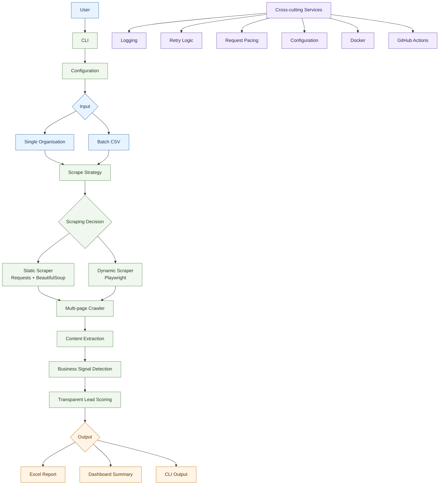

# Architecture

Smart Infrastructure Lead Intelligence uses a modular pipeline architecture for
single-organisation and batch CSV analysis. Each stage owns one responsibility,
which keeps the implementation testable and straightforward to extend.

## Component Responsibilities

### CLI

The CLI parses commands for single-organisation analysis, batch CSV analysis,
demo output, dashboard demos, and version information. It coordinates
configuration, logging, analysis execution, dashboard printing, and optional
Excel export.

### Configuration

Configuration loads typed runtime settings from environment variables and an
optional `.env` file. It controls request timeouts, retry settings, request
pacing, output directories, logging, and browser scraping options.

### Scrape Strategy

The scrape strategy selects static, dynamic, or automatic scraping for each
page. In `auto` mode it tries static scraping first and falls back to dynamic
scraping only when the static HTML appears insufficient.

### Static Scraper

The static scraper uses Requests to fetch HTML and Beautiful Soup to parse it.
It extracts visible text, metadata, emails, phone numbers, internal links, and
contact-related links from static pages.

### Dynamic Scraper

The dynamic scraper uses Playwright Chromium to render JavaScript-heavy public
pages. It supports browser timeouts, optional selector waits, optional post-load
waits, and conservative cookie-dialog handling.

### Crawler

The crawler visits a controlled number of internal pages from a starting URL.
It normalises URLs, avoids external links, applies request pacing, records page
failures, and aggregates extracted page data.

### Signal Detector

The signal detector applies transparent rule-based keyword matching to page
content. It records matched categories, matched keywords, and evidence excerpts
for business signals such as street lighting, smart city, procurement, and
energy efficiency.

### Scorer

The scorer calculates a transparent 0-100 lead score from detected signals and
public contact availability. It returns a priority classification and an
inspectable score breakdown.

### Exporter

The exporter converts analysed lead records and evidence into an Excel workbook
with structured sheets. It creates parent output directories, writes styled
tables, and verifies that the workbook can be reopened.

### Dashboard

The dashboard builds and prints a run-level summary for management review. It
reports lead counts, contact totals, evidence totals, score statistics, top
leads, and the most common detected signals.
